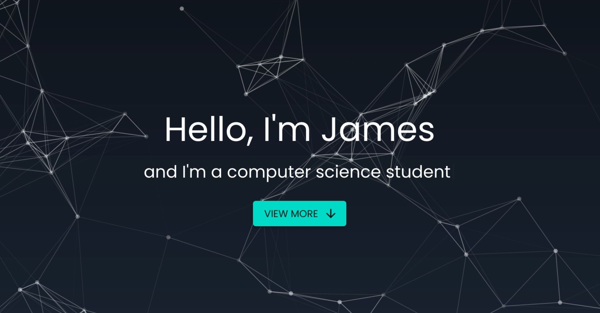
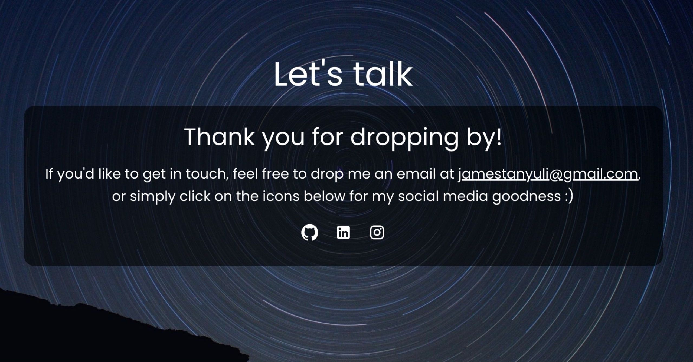

<h1 align="center">James' Personal Portfolio</h1>

<p align="center"></p>

This website was built to summarise my academic and professional journey as a computer science undergraduate, as well as to express my design language. Check it out at [jamestanyuli.com](https://www.jamestanyuli.com/).

The core packages/dependencies used are:
* [React](https://reactjs.org/)
* [Material UI](https://material-ui.com/)
* [Animate On Scroll](https://www.npmjs.com/package/aos)
* [React Router Hash Link](https://www.npmjs.com/package/react-router-hash-link)
* [React Particles](https://www.npmjs.com/package/react-particles-js)

Other packages used for both production and development can be found in [package.json](package.json).

This project was bootstrapped with [Create React App](https://github.com/facebook/create-react-app) and hosted on [Netlify](https://www.netlify.com/).<br/><br/>
[](https://app.netlify.com/sites/jamestanyuli/deploys)

## Sections

This website consists of the following sections:
* Hero (landing page)
* About
* Experience
* Projects
* Contact

## Project Structure
```bash
personal-portfolio
├── public/
└── src/
    │   index.js
    ├── components/
    ├── data/
    ├── images/
    └── styles/
```
